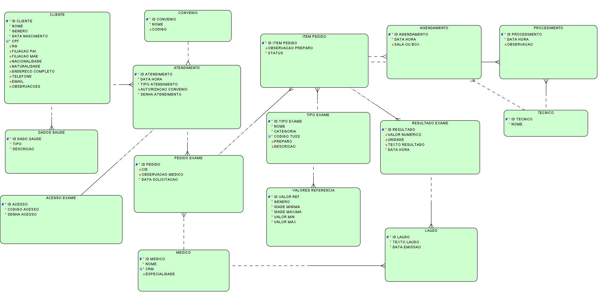
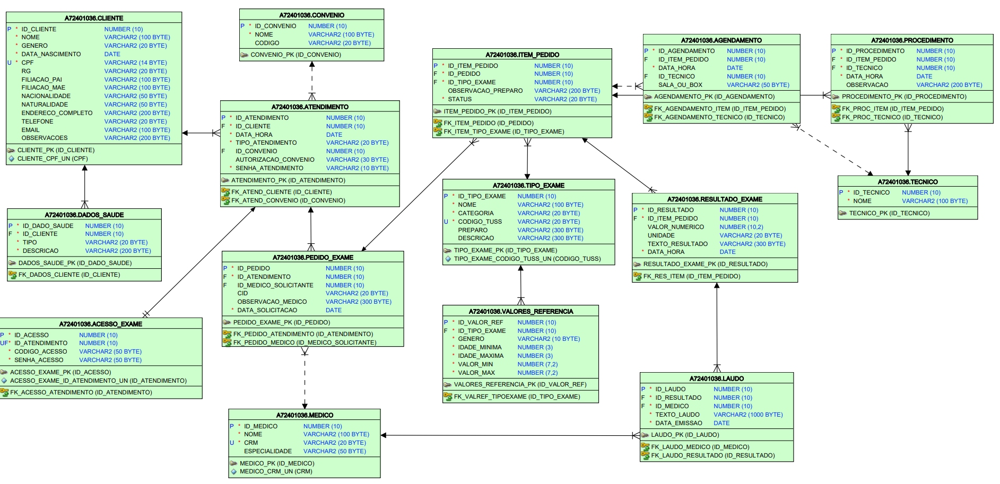

# 🏥 Sistema de Banco de Dados – Laboratório Clínico

Projeto acadêmico desenvolvido para modelagem e implementação de um banco de dados para um laboratório de análises clínicas e diagnóstico por imagem.

---

## Tecnologias

* Oracle Database
* SQL
* Modelagem Entidade-Relacionamento

---

## Principais Funcionalidades

* Cadastro de pacientes e dados de saúde
* Cadastro de médicos, técnicos e convênios
* Registro de atendimentos e pedidos de exames
* Agendamento de exames de imagem
* Registro de procedimentos e resultados
* Emissão de laudos médicos
* Histórico completo de exames por paciente

---

## Recursos Técnicos

* Chaves primárias e estrangeiras
* Restrições de integridade (UNIQUE e CHECK)
* Triggers para automação de regras de negócio
* Views para consultas operacionais e analíticas

---

Diagramas

Os modelos conceitual e lógico do banco de dados estão disponíveis na pasta:

## Diagramas

### Modelo Conceitual

### Modelo Lógico

